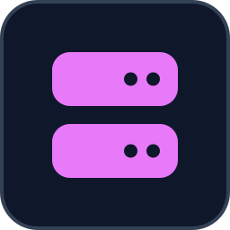
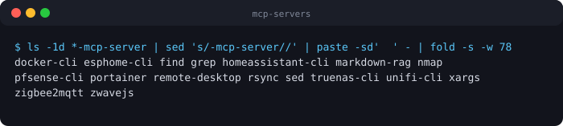

<p align="center">
  
</p>

# MCP Servers

<!-- BADGES:START -->


[](LICENSE.md)
[](CONTRIBUTING.md)
<!-- BADGES:END -->

## Table of Contents

- [Description](#description)
- [Screenshots](#screenshots)
- [Features](#features)
  - [The servers](#the-servers)
- [Requirements](#requirements)
- [Installation](#installation)
- [Usage](#usage)
  - [Configuring a server](#configuring-a-server)
  - [Registering a server with Claude Code](#registering-a-server-with-claude-code)
  - [Running over HTTP](#running-over-http)
  - [Running on a remote host](#running-on-a-remote-host)
- [Architecture](#architecture)
  - [Safety](#safety)
- [Credits](#credits)
- [Contributing](#contributing)
- [License](#license)

## Description

Seventeen [Model Context Protocol](https://modelcontextprotocol.io/) (MCP)
servers that let an AI assistant such as Claude work with a homelab: Docker and
Portainer, TrueNAS, pfSense, UniFi, Home Assistant, ESPHome, Zigbee2MQTT and
Z-Wave JS, plus safe wrappers around `find`, `grep`, `sed`, `rsync`, `nmap` and
`xargs`, a semantic search server for Markdown notes, and a VNC server for
seeing and driving remote desktops.

Sixteen are TypeScript packages in one npm workspace, sharing a common runtime
and offering both the stdio and streamable HTTP transports. The remote-desktop
server is written in Python.

## Screenshots

<p align="center">
  
</p>

<p align="center"><em>The servers in this workspace — CLI wrappers and service clients, each its own npm package.</em></p>

## Features

- **17 servers and 278 tools**, covering containers, storage, networking,
  home automation and the command line
- **Two transports** for every TypeScript server: stdio for local clients, and
  streamable HTTP
- **Local or remote execution**: the command-line servers run their commands
  on this machine or over SSH on another
- **Guard rails**: commands run without a shell, destructive operations need an
  explicit `confirm: true`, `xargs` only runs allow-listed commands, and output
  is capped
- **Built-in guidance**: each server ships instructions that tell the model how
  to use its tools, plus prompts and resources where they help
- **One shared runtime**, so a new server is a few files of tools

### The servers

Tool, resource and prompt counts are what each server reports when a client
connects.

**Command-line wrappers** (no credentials)

| Server | What it wraps | Tools | Prompts | HTTP port |
|---|---|---|---|---|
| [find](find-mcp-server/) | `find` | 3 | 1 | 3010 |
| [grep](grep-mcp-server/) | `grep` | 3 | 1 | 3011 |
| [sed](sed-mcp-server/) | `sed` | 3 | 1 | 3012 |
| [rsync](rsync-mcp-server/) | `rsync` | 2 | 1 | 3013 |
| [nmap](nmap-mcp-server/) | `nmap` | 4 | 1 | 3014 |
| [xargs](xargs-mcp-server/) | `xargs` | 1 | 0 | 3015 |

**Infrastructure over the command line** (local or SSH; no API keys)

| Server | What it talks to | Tools | Resources | Prompts | HTTP port |
|---|---|---|---|---|---|
| [docker-cli](docker-cli-mcp-server/) | Docker and Docker Compose | 35 | 2 | 2 | 3020 |
| [homeassistant-cli](homeassistant-cli-mcp-server/) | Home Assistant | 31 | 3 | 2 | 3021 |
| [esphome-cli](esphome-cli-mcp-server/) | ESPHome | 10 | 1 | 1 | 3022 |
| [truenas-cli](truenas-cli-mcp-server/) | TrueNAS SCALE, through `midclt` | 44 | 3 | 2 | 3023 |
| [pfsense-cli](pfsense-cli-mcp-server/) | pfSense | 27 | 3 | 2 | 3024 |
| [zigbee2mqtt](zigbee2mqtt-mcp-server/) | Zigbee2MQTT, over MQTT and Docker | 25 | 2 | 2 | 3025 |
| [zwavejs](zwavejs-mcp-server/) | Z-Wave JS UI, over MQTT and Docker | 22 | 2 | 2 | 3026 |
| [unifi-cli](unifi-cli-mcp-server/) | The UniFi Network controller's database, read-only | 19 | 3 | 2 | 3027 |

**API and knowledge-base servers**

| Server | What it talks to | Tools | Resources | Prompts | HTTP port |
|---|---|---|---|---|---|
| [portainer](portainer-mcp-server/) | The Portainer CE REST API | 36 | 5 | 3 | 3002 |
| [markdown-rag](markdown-rag-mcp-server/) | Semantic and hybrid search over Markdown files, with Qdrant and an Ollama embedding model | 4 | 1 | 1 | 3028 |

**Remote desktop** (Python)

| Server | What it does | Tools | Transport |
|---|---|---|---|
| [remote-desktop](remote-desktop-mcp-server/) | Screenshots, mouse and keyboard on Windows, Linux and macOS hosts over VNC, including Apple Remote Desktop sign-in | 9 | stdio |

Older REST-based `truenas`, `pfsense` and `unifi` servers are kept for reference
in [`_archive/`](_archive/) and are not maintained. [`claude-mcp-config/`](claude-mcp-config/)
holds example client configuration for third-party MCP servers.

## Requirements

- **Node.js 20.6** or newer and npm, for the TypeScript servers
- An **MCP client**, such as [Claude Code](https://claude.com/claude-code) or
  Claude Desktop
- Whatever each server drives: the `docker` CLI, `nmap`, SSH access to a host,
  an MQTT broker, a Portainer API key, a Qdrant and Ollama instance, and so on.
  Each server's `.env.example` lists its settings.
- For `remote-desktop`: **Python 3.10** or newer (its README uses 3.12) and a
  VNC server on each target host

## Installation

This is an npm workspace, so install and build **from the repository root**.
Running `npm install` inside one server's directory gives it its own copy of the
MCP SDK, and the type checker then fails on the mismatch.

```bash
git clone https://github.com/geoffmyers/mcp-servers.git
cd mcp-servers
npm install          # installs every server and builds the shared package
npm run build        # builds the shared package, then every server
```

Each server's entry point is then `<name>-mcp-server/dist/index.js`. To rebuild
one server:

```bash
npm run build --workspace=find-mcp-server
```

For `remote-desktop`, see [its README](remote-desktop-mcp-server/README.md).

## Usage

### Configuring a server

Servers read their settings from **environment variables**. Each server's
`.env.example` lists them. Either put them in the `env` block of your MCP
client's configuration, or copy the example and let Node load it:

```bash
cp portainer-mcp-server/.env.example portainer-mcp-server/.env
# edit the values, then:
node --env-file=portainer-mcp-server/.env portainer-mcp-server/dist/index.js
```

A server does not read `.env` on its own.

### Registering a server with Claude Code

Add the servers to a `.mcp.json` in your project, using absolute paths:

```json
{
  "mcpServers": {
    "find": {
      "command": "node",
      "args": ["/path/to/mcp-servers/find-mcp-server/dist/index.js"]
    },
    "portainer": {
      "command": "node",
      "args": ["/path/to/mcp-servers/portainer-mcp-server/dist/index.js"],
      "env": {
        "PORTAINER_HOST": "portainer.example.com",
        "PORTAINER_API_KEY": "your-api-key"
      }
    }
  }
}
```

Or from the command line:

```bash
claude mcp add find -- node /path/to/mcp-servers/find-mcp-server/dist/index.js
```

The client then lists each server's tools, and each tool's arguments are
described to the model. Destructive operations, such as removing a container,
pruning images, replacing text with `sed` or running a real `rsync`, only run
when the call includes `confirm: true`.

### Running over HTTP

With no argument a server speaks stdio. Pass `streamableHttp` to serve HTTP
instead, on the port in the tables above or on `$PORT`:

```bash
node find-mcp-server/dist/index.js streamableHttp          # port 3010
PORT=8080 node find-mcp-server/dist/index.js streamableHttp
```

Any other argument prints the usage.

### Running on a remote host

The command-line infrastructure servers run their commands locally by default.
To run them on another machine over SSH, set:

```bash
EXECUTION_MODE=ssh
SSH_HOST=nas.example.com     # a host your SSH config can reach without a password prompt
```

## Architecture

```
mcp-servers/
├── package.json                  # the npm workspace
├── mcp-server-shared/            # @geoffmyers/mcp-server-shared, the common runtime
└── <name>-mcp-server/
    ├── package.json
    ├── tsconfig.json             # extends the shared base config
    ├── docs/instructions.md      # guidance sent to the model; copied into dist/ on build
    └── src/
        ├── index.ts              # a few lines: runCli() picks stdio or HTTP
        ├── server/index.ts       # createServerFactory(): name, version, instructions
        ├── tools/                # the MCP tools
        ├── resources/            # MCP resources, where the server has any
        ├── prompts/              # MCP prompts
        └── lib/                  # only when a server needs its own client (REST, MQTT, MongoDB)
```

The shared package provides:

- `runCli()`, the single entry point that chooses the transport from the first
  argument
- `createServerFactory()`, which builds the server and loads its instructions
- `execute()`, `executeRemote()` and `executeAuto()`, which run commands without
  a shell, locally or over SSH according to `EXECUTION_MODE`
- `McpToolError` and consistent error formatting
- the stdio and streamable HTTP (Express) transports, and the base `tsconfig`

The MCP SDK and Zod are peer dependencies of the shared package, so every
server uses the single copy the workspace installs. Seven servers (find, grep,
nmap, portainer, rsync, sed and xargs) also include a Dockerfile.

See [ARCHITECTURE.md](ARCHITECTURE.md) for more detail.

### Safety

- Command-line servers pass arguments as an array to `execFile`, never through
  a shell, so arguments cannot inject commands.
- Destructive operations need an explicit `confirm: true`.
- `xargs` only runs commands on an allow-list.
- Command output is capped at 100 KB by default.
- The Portainer server skips TLS certificate checks, for self-signed homelab
  certificates, unless you set `PORTAINER_VERIFY_SSL=true`.

## Credits

- Built on the [Model Context Protocol](https://modelcontextprotocol.io/) and
  its [TypeScript SDK](https://github.com/modelcontextprotocol/typescript-sdk),
  with [Zod](https://zod.dev/) for schemas and
  [Express](https://expressjs.com/) for the HTTP transport.
- The MQTT servers use [MQTT.js](https://github.com/mqttjs/MQTT.js); the
  remote-desktop server uses the [MCP Python SDK](https://github.com/modelcontextprotocol/python-sdk),
  [asyncvnc](https://github.com/barneygale/asyncvnc),
  [Pillow](https://python-pillow.org/) and [NumPy](https://numpy.org/).
- Each infrastructure server is a thin layer over a system it does not include.
  Docker, Portainer, TrueNAS, pfSense, UniFi, Home Assistant, ESPHome,
  Zigbee2MQTT, Z-Wave JS, Qdrant and Ollama are independent projects and
  trademarks of their owners, and are not affiliated with this one.
- The README icon is the [Font Awesome](https://fontawesome.com/) `server` glyph,
  used under [CC BY 4.0](https://creativecommons.org/licenses/by/4.0/).

Written by Geoff Myers.

## Contributing

Bug reports and pull requests are welcome. See [CONTRIBUTING.md](CONTRIBUTING.md)
for setup, checks and how this repository is published. A new server is
easiest to start by copying an existing one; keep the `prepare` script out of
its `package.json`, since only the shared package has one.

## License

This program is free software: you can redistribute it and/or modify it under
the terms of the GNU General Public License as published by the Free Software
Foundation, either version 3 of the License, or (at your option) any later
version.

This program is distributed in the hope that it will be useful, but WITHOUT ANY
WARRANTY; without even the implied warranty of MERCHANTABILITY or FITNESS FOR A
PARTICULAR PURPOSE. See [LICENSE.md](LICENSE.md) for the full text of the GNU
General Public License.

SPDX-License-Identifier: `GPL-3.0-or-later`
